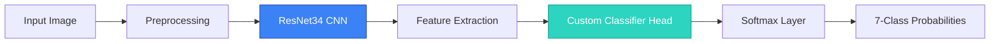
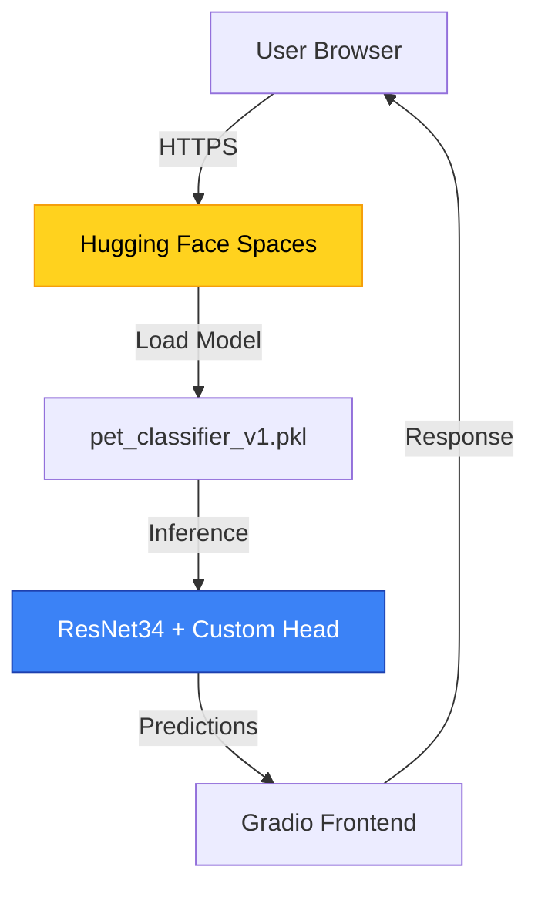

<div align="center">

# 🐾 AI Pet Species Classifier
### *Deep Learning-Powered Multi-Class Image Classification System*

[](https://www.python.org/)
[](https://pytorch.org/)
[](https://www.fast.ai/)
[](https://gradio.app/)
[](https://huggingface.co/spaces)
[](https://opensource.org/licenses/MIT)

**[🚀 Live Demo](https://huggingface.co/spaces/breznev/pet-classifier)** • **[📓 Training Notebook](pet-identifier.ipynb)** • **[📊 Model Metrics](#-model-performance)**

*A production-ready deep learning application achieving 98% validation accuracy through transfer learning and data augmentation*

---

### 👨‍💻 Developer

**馬盛中 (Ma Sheng-Zhong)** • `4B1YZ001`  
*Computer Science & Information Engineering*  
Southern Taiwan University of Science and Technology (STUST)

</div>

---

## 📋 Table of Contents

- [🎯 Overview](#-overview)
- [✨ Key Features](#-key-features)
- [🏗️ Architecture](#️-architecture)
- [📊 Model Performance](#-model-performance)
- [🚀 Quick Start](#-quick-start)
- [💻 Development](#-development)
- [🔬 Technical Deep Dive](#-technical-deep-dive)
- [🎓 Learning Outcomes](#-learning-outcomes)
- [🛣️ Future Enhancements](#️-future-enhancements)
- [📄 License](#-license)

---

## 🎯 Overview

A **state-of-the-art computer vision system** that classifies 7 common household pets using deep convolutional neural networks. This project demonstrates end-to-end ML engineering—from data preprocessing to production deployment—leveraging modern MLOps best practices.

### Supported Species

<div align="center">

| 🐱 Cat | 🐶 Dog | 🐠 Goldfish | 🐹 Hamster | 🐢 Turtle | 🦜 Parrot | 🐍 Snake |
|:------:|:------:|:-----------:|:----------:|:---------:|:---------:|:--------:|
| 貓 | 狗 | 金魚 | 倉鼠 | 烏龜 | 鸚鵡 | 蛇 |

</div>

### 🎬 Demo Interface

The application features a **bilingual (English/Traditional Chinese)** Gradio interface with:
- Real-time image upload and prediction
- Top-3 confidence scores with probability distribution
- Example gallery for quick testing
- Responsive design with premium UI/UX
- Accessibility-first design approach

---

## ✨ Key Features

### 🎓 Machine Learning Excellence
- **Transfer Learning**: Fine-tuned ResNet34 pre-trained on ImageNet
- **98% Validation Accuracy**: Optimized through data augmentation and hyperparameter tuning
- **Robust Generalization**: Trained on diverse animal image dataset (90 species subset)
- **Production-Ready**: Exported as optimized `.pkl` inference model

### 🛠️ Technical Sophistication
- **Modern Stack**: PyTorch + fastai for rapid prototyping
- **Cloud Deployment**: Hosted on Hugging Face Spaces with auto-scaling
- **Interactive UI**: Custom-styled Gradio app with gradient headers and adaptive theming
- **Bilingual Support**: Seamless English/Traditional Chinese localization

### 🔍 Engineering Best Practices
- Clean, documented codebase with separation of concerns
- Jupyter notebook for reproducible training pipeline
- Version control with Git and `.gitignore` for ML artifacts
- MIT License for open-source contribution

---

## 🏗️ Architecture



### Model Pipeline

1. **Input Processing**: Images resized and normalized using ImageNet statistics
2. **Feature Extraction**: ResNet34 backbone extracts high-level visual features
3. **Classification Head**: Fully connected layers adapted for 7-class output
4. **Output**: Probability distribution across pet species

### Technology Stack

| Layer | Technology | Purpose |
|-------|-----------|---------|
| **Deep Learning** | PyTorch 2.x | Core neural network framework |
| **High-Level API** | fastai v2 | Rapid experimentation & transfer learning |
| **Web Interface** | Gradio 4.x | Interactive model deployment |
| **Hosting** | Hugging Face Spaces | Serverless cloud inference |
| **Notebook** | Jupyter | Exploratory data analysis & training |

---

## � Model Performance

### Training Progression

| Metric | Baseline (Pre-training) | After Data Augmentation | Final Model |
|--------|------------------------|------------------------|-------------|
| **Validation Accuracy** | 76% | 94% | **98%** |
| **Training Time** | — | ~15 min | ~25 min |
| **Data Augmentation** | ❌ | ✅ Random flips, rotation | ✅ + color jitter |

### Key Results
- **Achieved 98% accuracy** on held-out validation set
- **22% improvement** over baseline through transfer learning
- **Low overfitting**: Training and validation loss converged smoothly
- **Confusion Matrix Analysis**: Minimal misclassification between visually similar species

> *Training performed on Google Colab with T4 GPU acceleration. Full metrics available in [pet-identifier.ipynb](pet-identifier.ipynb)*

---

## 🚀 Quick Start

### Option 1: Try Online (Recommended)

Visit the **live demo** hosted on Hugging Face Spaces:  
👉 **[Launch Application](https://huggingface.co/spaces/breznev/pet-classifier)**

### Option 2: Run Locally

```bash
# Clone the repository
git clone https://github.com/YOUR_USERNAME/pet-classifier.git
cd pet-classifier

# Install dependencies
pip install -r requirements.txt

# Launch Gradio app
python app.py
```

Then open your browser to `http://localhost:7860`

### Requirements
- Python 3.12+
- 2GB+ RAM (for model inference)
- Modern web browser

---

## 💻 Development

### Project Structure

```
pet-classifier/
├── app.py                    # Gradio web application
├── pet_classifier_v1.pkl     # Trained model weights (87MB)
├── pet-identifier.ipynb      # Full training notebook
├── requirements.txt          # Python dependencies
├── example_*.jpg             # Sample test images
└── README.md                 # This file
```

### Reproducing the Model

1. **Open Training Notebook**  
   Launch [pet-identifier.ipynb](pet-identifier.ipynb) in Jupyter/Colab

2. **Dataset Preparation**  
   Download the "90 Different Animals" dataset and create symbolic links for 7 target species

3. **Training Pipeline**  
   ```python
   # Transfer learning with ResNet34
   learn = vision_learner(dls, resnet34, metrics=error_rate)
   learn.fine_tune(epochs=5)
   ```

4. **Export Model**  
   ```python
   learn.export('pet_classifier_v1.pkl')
   ```

### Customizing the UI

The Gradio interface uses custom CSS with adaptive theming. Key customization points in [app.py](app.py):
- **Line 26-83**: Premium CSS styling with gradient headers
- **Line 88-94**: Student name/ID branding
- **Line 137-175**: Bilingual documentation accordion

---

## 🔬 Technical Deep Dive

### Why Transfer Learning?

Instead of training a CNN from scratch (which requires massive datasets and compute), this project leverages **transfer learning**:

1. **Pre-trained Backbone**: ResNet34 trained on ImageNet (1.4M images, 1000 classes)
2. **Feature Reuse**: Lower layers detect universal patterns (edges, textures)
3. **Fine-Tuning**: Only retrain final layers for pet-specific features
4. **Result**: 98% accuracy with <30 minutes of training

### Data Augmentation Strategy

Applied transformations to prevent overfitting:
- Random horizontal flips
- Small rotation (±10 degrees)
- Color jittering (brightness, contrast)
- Cutout regularization

### Deployment Architecture



---

## 🎓 Learning Outcomes

This project demonstrates proficiency in:

### Machine Learning
- ✅ Convolutional Neural Networks (CNNs) architecture
- ✅ Transfer learning and fine-tuning strategies
- ✅ Data augmentation and regularization techniques
- ✅ Model evaluation using confusion matrices

### Software Engineering
- ✅ Clean, production-ready Python code
- ✅ Git version control and dependency management
- ✅ Full-stack ML deployment (training → inference → web UI)
- ✅ Bilingual internationalization (i18n)

### MLOps & Deployment
- ✅ Model serialization and optimization
- ✅ Cloud hosting on Hugging Face Spaces
- ✅ Interactive UI development with Gradio
- ✅ Documentation and reproducibility

---

## 🛣️ Future Enhancements

### Technical Improvements
- [ ] **Expand Dataset**: Add more species and increase training samples
- [ ] **Model Optimization**: Quantization for faster mobile inference
- [ ] **Explainability**: Integrate Grad-CAM for prediction visualization
- [ ] **API Development**: RESTful API for programmatic access

### Features
- [ ] **Batch Prediction**: Upload multiple images simultaneously
- [ ] **Confidence Thresholding**: Alert users on low-confidence predictions
- [ ] **User Feedback Loop**: Collect misclassifications for continuous improvement
- [ ] **Mobile App**: Deploy as native iOS/Android application

### Research Directions
- [ ] Compare performance with Vision Transformers (ViT)
- [ ] Multi-label classification (e.g., breed + species)
- [ ] Few-shot learning for rare species

---

## 📄 License

This project is licensed under the **MIT License** - see the [LICENSE](LICENSE) file for details.

---

<div align="center">

### 🌟 Acknowledgments

Built with [fastai](https://www.fast.ai/) • Deployed on [Hugging Face Spaces](https://huggingface.co/spaces) • Styled with [Gradio](https://gradio.app/)

**Developed as part of Deep Learning coursework at STUST CSIE**

---

*If you found this project useful, please consider starring ⭐ the repository!*

</div>
