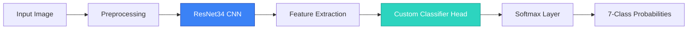
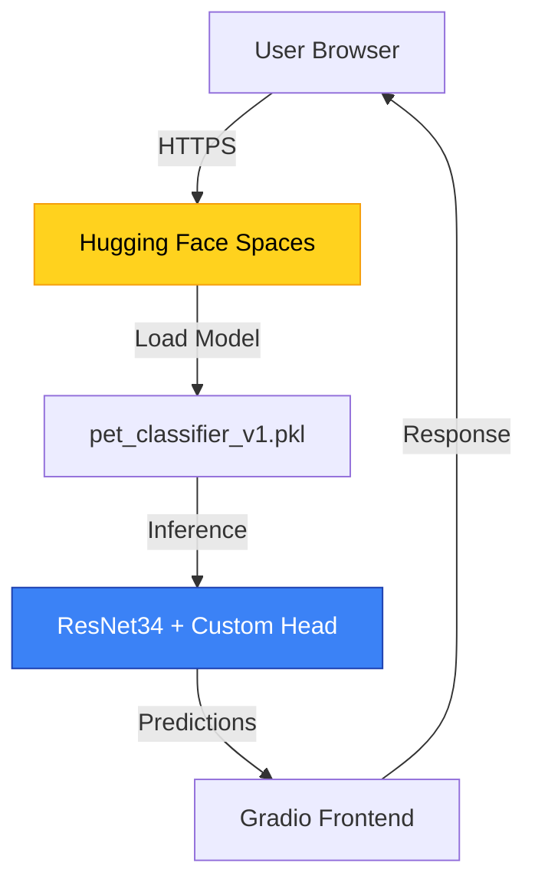
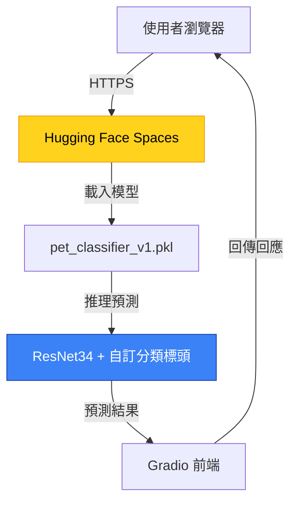

<p align="center">
  <a href="#english">
    
  </a>
  &nbsp;&nbsp;
  <a href="#繁體中文-taiwan">
    
  </a>
</p>

---

# English

<div align="center">

# AI Pet Species Classifier
### Deep learning image classifier

[](https://www.python.org/)
[](https://pytorch.org/)
[](https://www.fast.ai/)
[](https://gradio.app/)
[](https://huggingface.co/spaces)
[](https://opensource.org/licenses/MIT)

**[Live demo](https://huggingface.co/spaces/breznev/pet-classifier)** • **[📓 Training Notebook](pet-identifier.ipynb)** • **[📊 Model Metrics](#-model-performance)**

*A Gradio application with 98% validation accuracy using transfer learning and data augmentation.*

---

### 👨‍💻 Developer

**馬盛中 (Ma Sheng-Zhong)** • `4B1YZ001`  
*Computer Science & Information Engineering*  
Southern Taiwan University of Science and Technology (STUST)

</div>

---

## Table of contents

- [Overview](#overview)
- [Key features](#key-features)
- [Architecture](#architecture)
- [Model performance](#model-performance)
- [Quick start](#quick-start)
- [Development](#development)
- [Technical details](#technical-details)
- [Learning outcomes](#learning-outcomes)
- [Future enhancements](#future-enhancements)
- [License](#license)

---

## Overview

A computer vision model that classifies seven household pet species with a convolutional neural network. The project covers data preprocessing, model training, and deployment.

### Supported Species

<div align="center">

| 🐱 Cat | 🐶 Dog | 🐠 Goldfish | 🐹 Hamster | 🐢 Turtle | 🦜 Parrot | 🐍 Snake |
|:------:|:------:|:-----------:|:----------:|:---------:|:---------:|:--------:|
| 貓 | 狗 | 金魚 | 倉鼠 | 烏龜 | 鸚鵡 | 蛇 |

</div>

### Demo interface

The application features a **bilingual (English/Traditional Chinese)** Gradio interface with:
- Real-time image upload and prediction
- Top-3 confidence scores with probability distribution
- Example gallery for quick testing
- Responsive layout
- Accessibility-first design approach

---

## Key features

### Machine learning
- **Transfer Learning**: Fine-tuned ResNet34 pre-trained on ImageNet
- **98% Validation Accuracy**: Optimized through data augmentation and hyperparameter tuning
- **Training data**: Diverse animal image dataset (90-species subset)
- **Inference model**: Exported as an optimized `.pkl` file

### Technical details
- **Stack**: PyTorch and fastai
- **Cloud Deployment**: Hosted on Hugging Face Spaces with auto-scaling
- **Interactive UI**: Custom-styled Gradio app with gradient headers and adaptive theming
- **Bilingual support**: English and Traditional Chinese localization

### Engineering practices
- Clean, documented codebase with separation of concerns
- Jupyter notebook for reproducible training pipeline
- Version control with Git and `.gitignore` for ML artifacts
- MIT License for open-source contribution

---

## Architecture


```mermaid
graph LR
    A[Input Image] --> B[Preprocessing]
    B --> C[ResNet34 CNN]
    C --> D[Feature Extraction]
    D --> E[Custom Classifier Head]
    E --> F[Softmax Layer]
    F --> G[7-Class Probabilities]
    
    style C fill:#3b82f6,stroke:#1e40af,color:#fff
    style E fill:#2dd4bf,stroke:#0d9488,color:#fff
```

### Model Pipeline

1. **Input Processing**: Images resized and normalized using ImageNet statistics
2. **Feature Extraction**: ResNet34 backbone extracts high-level visual features
3. **Classification Head**: Fully connected layers adapted for 7-class output
4. **Output**: Probability distribution across pet species

### Technology Stack

| Layer | Technology | Purpose |
|-------|-----------|---------|
| **Deep Learning** | PyTorch 2.x | Core neural network framework |
| **High-Level API** | fastai v2 | Rapid experimentation & transfer learning |
| **Web Interface** | Gradio 4.x | Interactive model deployment |
| **Hosting** | Hugging Face Spaces | Serverless cloud inference |
| **Notebook** | Jupyter | Exploratory data analysis & training |

---

## Model performance

### Training Progression

| Metric | Baseline (Pre-training) | After Data Augmentation | Final Model |
|--------|------------------------|------------------------|-------------|
| **Validation Accuracy** | 76% | 94% | **98%** |
| **Training Time** | N/A | ~15 min | ~25 min |
| **Data Augmentation** | ❌ | ✅ Random flips, rotation | ✅ + color jitter |

### Key Results
- **Achieved 98% accuracy** on held-out validation set
- **22% improvement** over baseline through transfer learning
- **Low overfitting**: Training and validation loss converged smoothly
- **Confusion Matrix Analysis**: Minimal misclassification between visually similar species

> *Training performed on Google Colab with T4 GPU acceleration. Full metrics available in [pet-identifier.ipynb](pet-identifier.ipynb)*

---

## Quick start

### Option 1: Try online

Visit the **live demo** hosted on Hugging Face Spaces:  
**[Launch application](https://huggingface.co/spaces/breznev/pet-classifier)**

### Option 2: Run Locally

```bash
# Clone the repository
git clone https://github.com/YOUR_USERNAME/pet-classifier.git
cd pet-classifier

# Install dependencies
pip install -r requirements.txt

# Launch Gradio app
python app.py
```

Then open your browser to `http://localhost:7860`

### Requirements
- Python 3.12+
- 2GB+ RAM (for model inference)
- Modern web browser

---

## Development

### Project Structure

```
pet-classifier/
├── app.py                    # Gradio web application
├── pet_classifier_v1.pkl     # Trained model weights (87MB)
├── pet-identifier.ipynb      # Full training notebook
├── requirements.txt          # Python dependencies
├── example_*.jpg             # Sample test images
└── README.md                 # This file
```

### Reproducing the Model

1. **Open Training Notebook**  
   Launch [pet-identifier.ipynb](pet-identifier.ipynb) in Jupyter/Colab

2. **Dataset Preparation**  
   Download the "90 Different Animals" dataset and create symbolic links for 7 target species

3. **Training Pipeline**  
   ```python
   # Transfer learning with ResNet34
   learn = vision_learner(dls, resnet34, metrics=error_rate)
   learn.fine_tune(epochs=5)
   ```

4. **Export Model**  
   ```python
   learn.export('pet_classifier_v1.pkl')
   ```

### Customizing the UI

The Gradio interface uses custom CSS with adaptive theming. Key customization points in [app.py](app.py):
- **Lines 26-83**: CSS styling with gradient headers
- **Line 88-94**: Student name/ID branding
- **Line 137-175**: Bilingual documentation accordion

---

## Technical details

### Why Transfer Learning?

The project uses **transfer learning** instead of training a CNN from scratch:

1. **Pre-trained Backbone**: ResNet34 trained on ImageNet (1.4M images, 1000 classes)
2. **Feature Reuse**: Lower layers detect universal patterns (edges, textures)
3. **Fine-Tuning**: Only retrain final layers for pet-specific features
4. **Result**: 98% accuracy with <30 minutes of training

### Data Augmentation Strategy

Applied transformations to prevent overfitting:
- Random horizontal flips
- Small rotation (±10 degrees)
- Color jittering (brightness, contrast)
- Cutout regularization

### Deployment Architecture


```mermaid
graph TD
    A[User Browser] -->|HTTPS| B[Hugging Face Spaces]
    B -->|Load Model| C[pet_classifier_v1.pkl]
    C -->|Inference| D[ResNet34 + Custom Head]
    D -->|Predictions| E[Gradio Frontend]
    E -->|Response| A
    
    style B fill:#FFD21E,stroke:#F59E0B,color:#000
    style D fill:#3b82f6,stroke:#1e40af,color:#fff
```

---

## Learning outcomes

This project demonstrates proficiency in:

### Machine Learning
- Convolutional Neural Networks (CNNs) architecture
- Transfer learning and fine-tuning strategies
- Data augmentation and regularization techniques
- Model evaluation using confusion matrices

### Software Engineering
- Documented Python code
- Git version control and dependency management
- Full-stack ML deployment (training → inference → web UI)
- Bilingual internationalization (i18n)

### MLOps & Deployment
- Model serialization and optimization
- Cloud hosting on Hugging Face Spaces
- Interactive UI development with Gradio
- Documentation and reproducibility

---

## Future enhancements

### Technical Improvements
- [ ] **Expand Dataset**: Add more species and increase training samples
- [ ] **Model Optimization**: Quantization for faster mobile inference
- [ ] **Explainability**: Integrate Grad-CAM for prediction visualization
- [ ] **API Development**: RESTful API for programmatic access

### Features
- [ ] **Batch Prediction**: Upload multiple images simultaneously
- [ ] **Confidence Thresholding**: Alert users on low-confidence predictions
- [ ] **User Feedback Loop**: Collect misclassifications for continuous improvement
- [ ] **Mobile App**: Deploy as native iOS/Android application

### Research Directions
- [ ] Compare performance with Vision Transformers (ViT)
- [ ] Multi-label classification (e.g., breed + species)
- [ ] Few-shot learning for rare species

---

## License

This project is licensed under the **MIT License** - see the [LICENSE](LICENSE) file for details.

---

<div align="center">

### 🌟 Acknowledgments

Built with [fastai](https://www.fast.ai/) • Deployed on [Hugging Face Spaces](https://huggingface.co/spaces) • Styled with [Gradio](https://gradio.app/)

**Developed as part of Deep Learning coursework at STUST CSIE**

---

*If you found this project useful, please consider starring ⭐ the repository!*

</div>

---

# 繁體中文 (Taiwan)

<div align="center">

# 🐾 AI 寵物物種分類器
### *基於深度學習的多類別影像分類系統*

[](https://www.python.org/)
[](https://pytorch.org/)
[](https://www.fast.ai/)
[](https://gradio.app/)
[](https://huggingface.co/spaces)
[](https://opensource.org/licenses/MIT)

**[🚀 線上展示](https://huggingface.co/spaces/breznev/pet-classifier)** • **[📓 訓練筆記本](pet-identifier.ipynb)** • **[📊 模型指標](#-模型效能)**

*一個基於遷移學習與資料增強、驗證準確率達 98% 的生產級深度學習應用程式*

---

### 👨‍💻 開發者

**馬盛中 (Ma Sheng-Zhong)** • `4B1YZ001`  
*資訊工程系*  
南臺科技大學 (STUST)

</div>

---

## 📋 目錄

- [🎯 專案概述](#-專案概述)
- [✨ 核心特點](#-核心特點)
- [🏗️ 系統架構](#️-系統架構)
- [📊 模型效能](#-模型效能)
- [🚀 快速開始](#-快速開始)
- [💻 開發指南](#-開發指南)
- [🔬 技術深入解析](#-技術深入解析)
- [🎓 學習成果](#-學習成果)
- [🛣️ 未來改進與規劃](#-未來改進與規劃)
- [📄 授權條款](#-授權條款)

---

## 🎯 專案概述

本專案使用深度卷積神經網路 (CNN) 分類 7 種常見家養寵物，涵蓋資料預處理、模型訓練與部署。

### 支援物種

<div align="center">

| 🐱 貓 | 🐶 狗 | 🐠 金魚 | 🐹 倉鼠 | 🐢 烏龜 | 🦜 鸚鵡 | 🐍 蛇 |
|:------:|:------:|:-----------:|:----------:|:---------:|:---------:|:--------:|
| Cat | Dog | Goldfish | Hamster | Turtle | Parrot | Snake |

</div>

### 🎬 介面展示

本應用程式具備**雙語 (英文/繁體中文)**的 Gradio 互動介面：
- 即時影像上傳與預測
- 前三名信賴度分數與機率分佈
- 提供快速測試的範例圖片藝廊
- 具備優質 UI/UX 的響應式設計
- 無障礙設計優先原則

---

## ✨ 核心特點

### 🎓 機器學習卓越實踐
- **遷移學習 (Transfer Learning)**：微調在 ImageNet 上預先訓練好的 ResNet34 模型
- **98% 驗證準確率**：透過資料增強與超參數調整進行優化
- **強健的泛化能力**：在多樣化的動物影像數據集（90 種物種的子集）上進行訓練
- **生產就緒**：匯出為最佳化的 `.pkl` 推理模型

### 🛠️ 技術先進性
- **現代技術棧**：使用 PyTorch + fastai 進行快速原型開發
- **雲端部署**：託管於 Hugging Face Spaces 並支援自動彈性擴展
- **互動式 UI**：自訂樣式的 Gradio 應用程式，具備漸層標頭與自適應主題
- **雙語支援**：流暢的英文/繁體中文本地化

### 🔍 工程最佳實踐
- 關注點分離、乾淨且文件完善的程式碼庫
- 提供可重現訓練流程的 Jupyter 筆記本
- 使用 Git 進行版本控制，並以 `.gitignore` 排除機器學習產出物
- 採用 MIT 授權條款以利開源貢獻

---

## 🏗️ 系統架構


```mermaid
graph LR
    A[輸入影像] --> B[預處理]
    B --> C[ResNet34 CNN]
    C --> D[特徵擷取]
    D --> E[自訂分類器標頭]
    E --> F[Softmax 層]
    F --> G[7 類機率分佈]
    
    style C fill:#3b82f6,stroke:#1e40af,color:#fff
    style E fill:#2dd4bf,stroke:#0d9488,color:#fff
```

### 模型處理流程
1. **輸入處理**：調整影像大小並使用 ImageNet 統計數據進行標準化
2. **特徵擷取**：以 ResNet34 為骨幹網路擷取高階視覺特徵
3. **分類器標頭**：自訂的全連接層，適配 7 種分類的輸出
4. **輸出**：寵物物種的機率分佈

### 技術棧

| 圖層 / 組件 | 使用技術 | 用途 |
|-------|-----------|---------|
| **深度學習** | PyTorch 2.x | 核心神經網路框架 |
| **高階 API** | fastai v2 | 快速實驗與遷移學習 |
| **網頁介面** | Gradio 4.x | 互動式模型部署 |
| **託管平台** | Hugging Face Spaces | 無伺服器雲端推理 |
| **筆記本** | Jupyter | 探索性資料分析與模型訓練 |

---

## 📊 模型效能

### 訓練進程

| 指標 | 基準模型 (預訓練) | 加入資料增強後 | 最終模型 |
|--------|------------------------|------------------------|-------------|
| **驗證準確率** | 76% | 94% | **98%** |
| **訓練時間** | N/A | ~15 分鐘 | ~25 分鐘 |
| **資料增強** | ❌ | ✅ 隨機翻轉、旋轉 | ✅ + 色彩抖動 (Color Jitter) |

### 關鍵結果
- 在預留的驗證集上達到 **98% 的準確率**
- 透過遷移學習相較於基準模型提升了 **22%**
- **低過擬合 (Overfitting)**：訓練與驗證損失平滑收斂
- **混淆矩陣分析**：視覺相似物種之間的誤判率極低

> *模型訓練於 Google Colab (配備 T4 GPU 加速)。完整指標請見 [pet-identifier.ipynb](pet-identifier.ipynb)*

---

## 🚀 快速開始

### 選項 1：線上試用（推薦）

造訪託管於 Hugging Face Spaces 的**線上展示**：  
👉 **[啟動應用程式](https://huggingface.co/spaces/breznev/pet-classifier)**

### 選項 2：本地執行

```bash
# 複製專案庫
git clone https://github.com/YOUR_USERNAME/pet-classifier.git
cd pet-classifier

# 安裝相依套件
pip install -r requirements.txt

# 啟動 Gradio 應用程式
python app.py
```

接著在瀏覽器中開啟 `http://localhost:7860`

### 系統要求
- Python 3.12+
- 2GB+ 記憶體（用於模型推理）
- 現代網頁瀏覽器

---

## 💻 開發指南

### 專案結構

```
pet-classifier/
├── app.py                    # Gradio 網頁應用程式
├── pet_classifier_v1.pkl     # 已訓練的模型權重 (87MB)
├── pet-identifier.ipynb      # 完整的訓練筆記本
├── requirements.txt          # Python 相依套件
├── example_*.jpg             # 測試範例圖片
└── README.md                 # 本文件
```

### 重現模型訓練

1. **開啟訓練筆記本**  
   在 Jupyter 或 Colab 中開啟 [pet-identifier.ipynb](pet-identifier.ipynb)

2. **準備數據集**  
   下載 "90 Different Animals" 數據集，並為 7 種目標物種建立符號連結

3. **訓練流程**  
   ```python
   # 使用 ResNet34 進行遷移學習
   learn = vision_learner(dls, resnet34, metrics=error_rate)
   learn.fine_tune(epochs=5)
   ```

4. **匯出模型**  
   ```python
   learn.export('pet_classifier_v1.pkl')
   ```

### 自訂 UI 介面

Gradio 介面使用自訂 CSS 並支援自適應主題。在 [app.py](app.py) 中可自訂的關鍵部分：
- **第 26-83 行**：具備漸層標頭的優質 CSS 樣式
- **第 88-94 行**：學生姓名/學號浮水印與品牌標誌
- **第 137-175 行**：雙語文件摺疊選單 (Accordion)

---

## 🔬 技術深入解析

### 為什麼選擇遷移學習？

本專案並非從頭開始訓練 CNN (這需要龐大的數據集與計算資源)，而是採用了**遷移學習**：

1. **預訓練主幹網路**：使用在 ImageNet (140 萬張圖片，1000 個類別) 上訓練過的 ResNet34
2. **特徵重用**：底層神經網路可偵測通用特徵 (如邊緣、紋理)
3. **微調 (Fine-Tuning)**：僅重新訓練最後幾層以適應特定的寵物特徵
4. **結果**：在小於 30 分鐘的訓練時間內取得 98% 的準確率

### 資料增強策略 (Data Augmentation)

應用了以下轉換以防止過擬合：
- 隨機水平翻轉
- 微小旋轉 (±10 度)
- 色彩抖動 (亮度、對比度)
- Cutout 正規化

### 部署架構


```mermaid
graph TD
    A[使用者瀏覽器] -->|HTTPS| B[Hugging Face Spaces]
    B -->|載入模型| C[pet_classifier_v1.pkl]
    C -->|推理預測| D[ResNet34 + 自訂分類標頭]
    D -->|預測結果| E[Gradio 前端]
    E -->|回傳回應| A
    
    style B fill:#FFD21E,stroke:#F59E0B,color:#000
    style D fill:#3b82f6,stroke:#1e40af,color:#fff
```

---

## 🎓 學習成果

本專案展現了在以下領域的專業能力：

### 機器學習
- 卷積神經網路 (CNN) 架構設計
- 遷移學習與微調策略
- 資料增強與正規化技術
- 利用混淆矩陣進行模型評估

### 軟體工程
- 乾淨且生產就緒的 Python 程式碼
- Git 版本控制與相依性管理
- 完整生命週期的機器學習開發流程 (訓練 → 推理 → 網頁 UI)
- 雙語國際化 (i18n)

### MLOps 與部署
- 模型序列化與優化
- Hugging Face Spaces 雲端託管
- 使用 Gradio 進行互動式 UI 開發
- 專案文件建置與可重現性

---

## 🛣️ 未來改進與規劃

### 技術改進
- [ ] **擴充數據集**：加入更多物種並增加訓練樣本數
- [ ] **模型優化**：進行量化以加速行動端推理
- [ ] **可解釋性**：整合 Grad-CAM 實現預測可視化
- [ ] **API 開發**：提供 RESTful API 以利程式化存取

### 新增功能
- [ ] **批次預測**：支援同時上傳並預測多張影像
- [ ] **信賴度閾值機制**：針對低信賴度預測向用戶發出警告
- [ ] **用戶回饋機制**：收集誤判樣本以進行持續改進
- [ ] **行動應用程式**：部署為原生 iOS/Android App

### 研究方向
- [ ] 與 Vision Transformers (ViT) 進行效能對比
- [ ] 多標籤分類 (例如：同時識別品種 + 物種)
- [ ] 針對稀有物種的少樣本學習 (Few-shot learning)

---

## 📄 授權條款

本專案採用 **MIT 授權條款** - 詳見 [LICENSE](LICENSE) 檔案。

---

<div align="center">

### 🌟 致謝

基於 [fastai](https://www.fast.ai/) 建置 • 部署於 [Hugging Face Spaces](https://huggingface.co/spaces) • 使用 [Gradio](https://gradio.app/) 設計樣式

**本專案為南臺科技大學資訊工程系深度學習課程作業的一部分**

---

*如果您覺得本專案有用，請考慮給本專案庫一顆星星 ⭐！*

</div>

